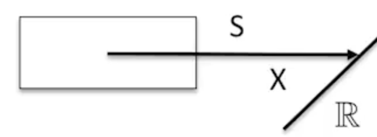
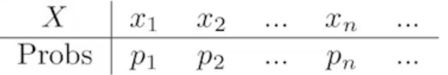
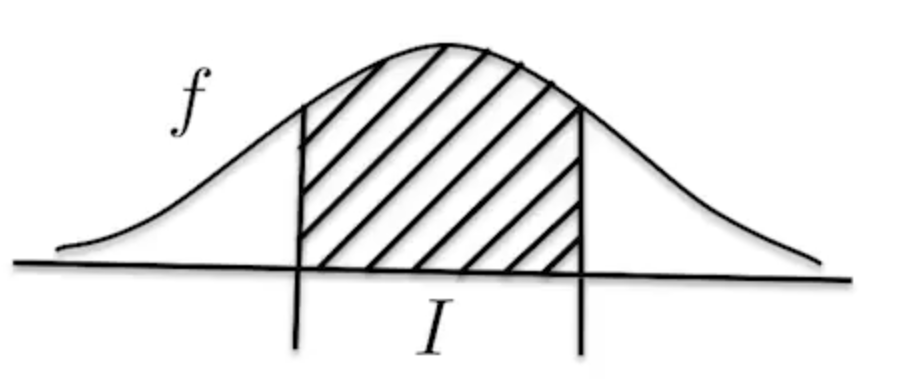
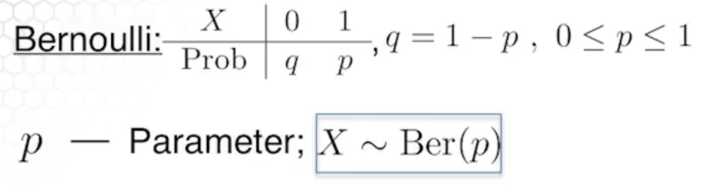
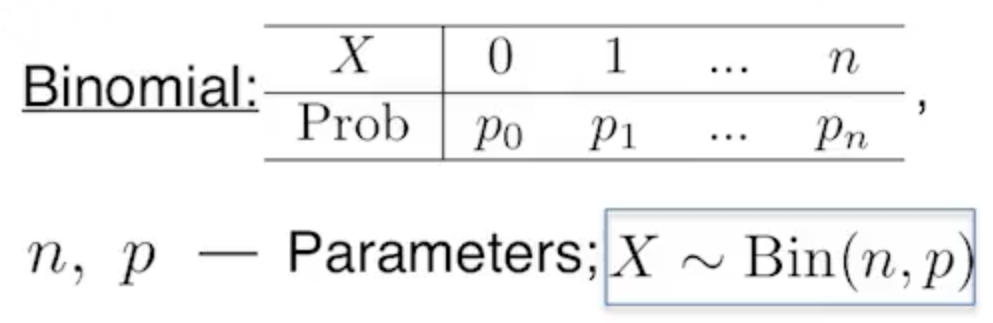
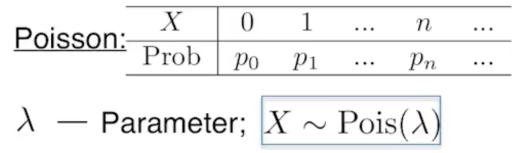

# Basic Distributions

## Random variables

Random variables are not variables, they are mappings.
A random variable $X$ is a function mapping the sample space $S$ to the real numbers $\mathbb{R}$.

$$X: S \rightarrow \mathbb{R}$$

**Example:** Flip a fair coin. If heads, pay \$1. If tails, get \$1. Your gain in one flip is a random variable, mapping $\{H,T\}$ to $\{-1,1\}$.

Random variables can be discrete or continuous.

### Discrete random variables

Discrete random variables can be represented by a table. This mapping is called a **probability mass function**.

Some notation -

$$P(X=x_i) = p_i$$

The sum of all possible outcomes equals 1.

$$\sum p_i=1$$

### Continuous random variables

The events map to points in an interval. We use a **probability density function (pdf)** instead of a probability mass function **(pmf)**.

We calculate the probability of an event happening in the interval $I$ as -

$$P(X \in I) = \int_If(x)dx$$

Integrating over all possible values yields 1 -

$$\int_{-\infty}^{\infty}f(x)dx=1$$

## Discrete distributions

### Bernoulli distribution

The **Bernoulli distribution** is like flipping a potentially unfair coin once.

### Binomial distribution

The **binomial distribution** is like flipping a potentially unfair coin many times.

In this case $P(X=k)$ is the probability that the coin has landed on heads $k$ times out of the $n$ total trials. There is a well-known formula.

$$p_k = P(X=k) = {n \choose k}p^kq^{n-k},q=1-p,k \in \{0,1,...,n\}$$

### Poisson distribution

The **poisson distribution** has a random variable that is not bounded above.

$$p_k = P(X=k) = \frac{\lambda^k}{k!}e^{-\lambda},\lambda > 0,k \in \{0,1,2,...\}$$

The poisson distribution represents a limiting distribution from the binomial when $n$ is large and $p$ is very small, and the product $np$ approximates $\lambda$

## Continuous distributions

### Uniform distribution

A continuous distribution that has a constant pdf over an interval $[a,b]$ is a **uniform distribution**.

$$
f(x) =
\begin{cases}
   \frac{1}{b-a} &\text{if } a \leq x \leq b \\
  0 &\text{otherwise }
\end{cases}
$$

### Exponential distribution

The exponential distribution is as follows

$$f(x)=\lambda e ^{-\lambda x}, \lambda >0, x \geq 0$$

We can parameterize the distribution by $\lambda$, also called the **rate** or we can parameterize by $\mu = \frac{1}{\lambda}$, the **scale**.

$$f(x)= \frac{1}{\mu}e^{-x/\mu}, \mu > 0, x \geq 0$$

### Beta distribution

$$f(x)=\frac{1}{B(a,b)}x^{a-1}(1-x)^{b-1}dx, 0\leq x \leq 1 $$

$B(a,b)$ is a **beta function** which normalizes the distribution so that the integral over $[0,1]$ is 1.

$$B(a,b)= \int_0^1x^{a-1}(1-x)^{b-1}dx$$

The parameters of the beta distribution are $a$ and $b$.

### Normal distribution

The normal distribution is important because as you take the sum of independent identically distributed random variables the distribution of the sum converges to a normal distribution. This is known as the **central limit theorem**.

$$f(x) = \frac{1}{\sqrt{2\pi\sigma^2}}e^{-\frac{(x-\mu)^2}{2\sigma^2}}$$

Constraints are

$$-\infty < x < \infty, -\infty<\mu<\infty, \sigma > 0$$

We can describe the distribution of a normal random variable $X$ with its parameters $\mu, \sigma^2$ as $X \sim N(\mu, \sigma^2)$.

## Cumulative distribution functions (CDF)

The **cumulative distribution function (CDF)** is the probability that $X \leq x$ for some $x$.

For example, if our distribution is binomial n=2, p=.5, then the CDF would tell you that the probability of $\leq 1$ successes is .75.

For discrete distribution functions the CDF $F$ is

$$
F(x) \stackrel{\text{def}}{=} P(X \leq x) = \sum_{x_i \leq x} P(X = x_i)
$$

For continuous distributions

$$
F(x) \stackrel{\text{def}}{=} P(X \leq x) = \int_{-\infty}^x f(x)dx
$$

Graphically, this is the area under the curve up to a point.

So the CDF is a non-decreasing function that converges to 1.

**Example: exponential distribution**

For an exponential distribution -

$$X \sim \text{Exp}(\lambda), f(x) = \lambda e^{-\lambda x}, x \geq 0$$
We can calculate the cumulative distribution function $F$.

$$
\begin{align}
   F(x) &= \int_{-\infty}^xf(t)dt = \int_{0}^xf(t)dt\\
   &=-e^{-\lambda t} |_0^x \\
   &=-e^{-\lambda x} - (-1) \\
   &=1-e^{-\lambda x} \\
\end{align}
$$
