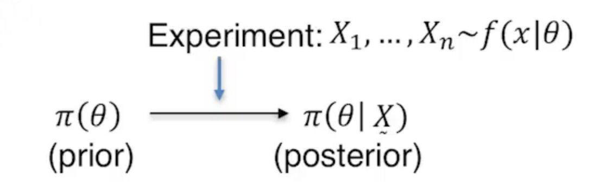
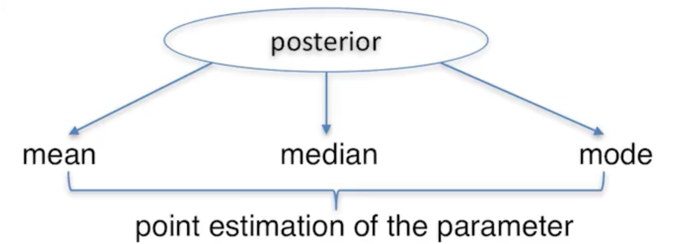
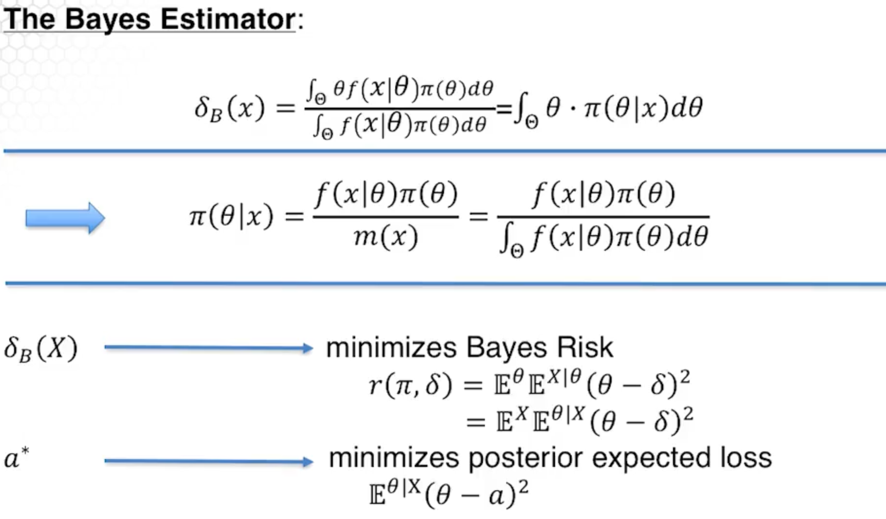

# Bayesian Conjugate Families

Bayesians turn prior information and observed data into a posterior distribution. We do this using Bayes theorem.

The professor discusses **estimation** and **testing**.

- estimation can be point estimates or estimating intervals.
- I imagine testing is something like a hypothesis test.

## Point estimates

Bayes' estimators are functions of $X_1,...,X_n$. When $X_1,...,X_n$ are observed, Bayes estimators are called are called an action $a$.

- A **posterior mean** minimizes $\mathbb{E}^{\theta|X}[(\theta - a)^2]$ with respect to $a$.
- A **posterior median** minimizes $\mathbb{E}^{\theta|X}[|\theta - a|]$ with respect to $a$.

Define $L_C(\theta, a)$ as follows:

$$
L_C(\theta, a) = \begin{cases}
0, \text{ } |\theta-a| \leq c\\
1, \text{else}
\end{cases}
$$

The **posterior mode** is an action that minimizes

$$\lim_{c \rightarrow 0}\mathbb{E}^{\theta|X}[L_C(\theta, a)]$$

with respect to $a$.

## Bayes risk

The most common Bayes estimator is the **posterior mean**. There is a frequentist rule that minimizes **Bayes risk**,

$$\mathbb{E}^\theta\mathbb{E}^{X|\theta}[(\theta - \delta(X))^2]$$

is the posterior mean $\delta_B(X)$. If X is observed, that is, if $\delta_B(X)$ is conditioned on $X$, the result is Bayes action.

**Bayes risk** is

$$r(\theta, \delta) = \mathbb{E}^\theta\mathbb{E}^{X|\theta}[(\theta - \delta(X))^2]=\mathbb{E}^X\mathbb{E}^{\theta|X}[(\theta - \delta(X))^2]$$

Posterior mean minimizes Bayes risk.

## Bayes estimator

This is getting intense! Here's an image from the lectures.

